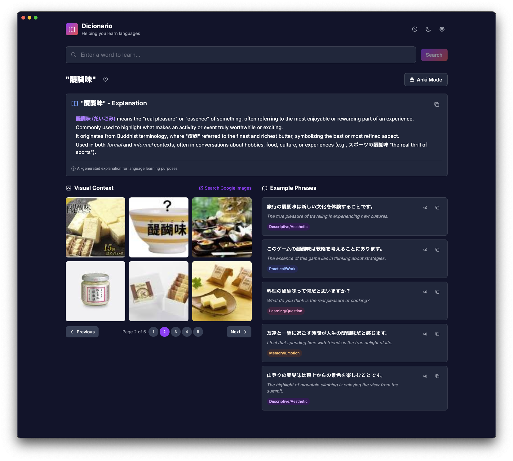

# Exemplar

An AI-powered vocabulary learning companion built with Electron, React, and TypeScript. Exemplar accelerates language acquisition by providing visual context, intelligent explanations, and example phrases with audio pronunciation for vocabulary words.



## Features

### 🔍 **Smart Search with History**
- Search field with autocomplete based on previous searches
- SQLite database stores search history with frequency tracking
- Keyboard navigation support (arrows, enter, escape)

### 🧠 **AI-Powered Word Explanations**
- Language-aware explanations tailored to your target language
- Cultural context and usage nuances for better understanding
- Etymology and collocations within specific language families
- Copy explanations for study notes and flashcards

### 🖼️ **Visual Context**
- 3x2 image grid showing contextual photos for vocabulary words
- **Pagination support** - Navigate through multiple pages of images
- Multiple image search providers (Google, DuckDuckGo, Pixabay)
- Click images to copy URLs for Anki cards
- Intelligent fallback systems for reliable results
- Previous/Next buttons with page indicators

### 💬 **Example Phrases**
- AI-generated example sentences with translations
- Categorized phrases (Descriptive/Aesthetic, Practical/Work, etc.)
- One-click copy functionality for phrases
- Color-coded category tags

### 🔊 **Audio Pronunciation**
- Text-to-speech for all example phrases
- Google Cloud TTS integration with Web Speech API fallback
- Play/pause controls for each phrase
- Multiple language and voice support

### 🎨 **Modern UI**
- Dark theme optimized for extended study sessions
- Responsive design with smooth animations
- Keyboard shortcuts for efficient navigation
- Clean, distraction-free interface

## Installation

### Prerequisites
- Node.js 18+ 
- Python 3.x (for native dependencies)
- Xcode Command Line Tools (macOS)

### Setup
1. Clone the repository:
   ```bash
   git clone <repository-url>
   cd exemplar
   ```

2. Install dependencies:
   ```bash
   npm install
   ```

3. Start development server:
   ```bash
   npm run dev
   ```

## Development

### Project Structure
```
src/
├── main/               # Electron main process
│   ├── main.ts        # Application entry point
│   ├── preload.ts     # IPC bridge
│   └── services/      # Backend services
│       ├── database.ts # SQLite operations
│       ├── search.ts   # Image search & LLM integration
│       └── tts.ts      # Text-to-speech service
├── renderer/          # React frontend
│   ├── components/    # UI components
│   │   ├── Pagination.tsx  # Pagination controls
│   │   └── VisualContext.tsx # Image display with pagination
│   ├── App.tsx       # Main app component
│   └── main.tsx      # React entry point
└── shared/           # Shared types and utilities
    └── types.ts      # TypeScript interfaces
```

### Available Scripts
- `npm run dev` - Start development server
- `npm run build` - Build for production
- `npm run pack` - Create distributable packages
- `npm run format` - Format code with Prettier
- `npm test` - Run unit tests
- `npm run test:ui` - Open test UI

### Database Schema
The app uses SQLite to store search history:

```sql
searches (
  id INTEGER PRIMARY KEY,
  word TEXT UNIQUE,
  search_count INTEGER DEFAULT 1,
  last_searched DATETIME,
  created_at DATETIME
)
```

## API Integration

The app supports multiple APIs for enhanced functionality:

### Image Search
- **Google Custom Search API** (premium, high quality)
- **DuckDuckGo Images** (free, good coverage)
- **Pixabay API** (free with API key)
- Mock data for development

### Language Models
- **OpenAI GPT-4o-mini** for explanations and phrase generation
- Language-aware prompting for cultural context
- Mock content for development

### Text-to-Speech
- **Google Cloud Text-to-Speech** (premium, high quality)
- **Web Speech API** (built-in, free fallback)
- Audio caching for improved performance

## Configuration

API keys can be configured through the settings panel:

```typescript
interface AppSettings {
  googleApiKey?: string;
  googleSearchEngineId?: string;
  openaiApiKey?: string;
  pixabayApiKey?: string;
  preferredLanguage: string;
  imageSearchProvider: 'duckduckgo' | 'google' | 'pixabay' | 'auto';
  voiceSettings: {
    provider: 'google' | 'web';
    language: string;
    voice?: string;
  };
}

interface PaginationOptions {
  page: number;
  perPage: number;
}

interface PaginatedImageResult {
  images: ImageResult[];
  currentPage: number;
  totalPages: number;
  hasNext: boolean;
  hasPrevious: boolean;
}
```

## Testing

The project includes comprehensive unit tests:

```bash
# Run all tests
npm test

# Run tests in watch mode
npm run test:watch

# Open test UI
npm run test:ui
```

### Test Coverage
- Component rendering and interactions
- **Pagination component** functionality and state management
- Search functionality and autocomplete
- Database operations
- API service mocking
- Keyboard navigation
- Loading states and error handling

## Building for Production

### Development Build
```bash
npm run build
```

### Create Distributables
```bash
npm run pack
```

Supports packaging for:
- **macOS**: .dmg and .app
- **Windows**: .exe and .msi  
- **Linux**: .AppImage and .deb

## Usage Tips

### Keyboard Shortcuts
- `⌘/Ctrl + K` - Focus search bar and show recent searches
- `⌘/Ctrl + P` - Paste from clipboard and search automatically
- `↑/↓` - Navigate autocomplete suggestions
- `Enter` - Select suggestion or search
- `Escape` - Close autocomplete dropdown

### Study Workflow
1. **Search** for a new vocabulary word
2. **Read** the AI-generated explanation for context and cultural understanding
3. **Browse** the visual context images with pagination for more options
4. **Study** generated example phrases with translations
5. **Listen** to pronunciation audio
6. **Copy** explanations and phrases for your Anki cards
7. **Export** images by clicking and copying URLs

### Best Practices
- Set your preferred language in settings for accurate explanations
- Use descriptive search terms for better image results
- **Navigate through multiple image pages** to find the most relevant visuals
- Read explanations first to understand cultural context
- Listen to phrases multiple times for pronunciation practice
- Copy both explanations and phrases for comprehensive cards
- Regular review of search history to reinforce learning

## Contributing

1. Fork the repository
2. Create a feature branch: `git checkout -b feature-name`
3. Make changes and add tests
4. Commit changes: `git commit -am 'Add feature'`
5. Push to branch: `git push origin feature-name`
6. Submit a pull request

### Code Style
- TypeScript with strict mode
- React with hooks and functional components
- Tailwind CSS for styling
- ESLint + Prettier for formatting

## License

MIT License - see [LICENSE](LICENSE) file for details.

## Acknowledgments

- Word explanations and example phrases powered by OpenAI GPT-4o-mini
- Image search via Google Custom Search, DuckDuckGo, and Pixabay APIs
- Text-to-speech using Google Cloud TTS and Web Speech API
- UI components inspired by modern language learning apps
- Icon design from Heroicons
- Built with Electron, React, TypeScript, and Tailwind CSS